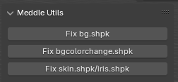
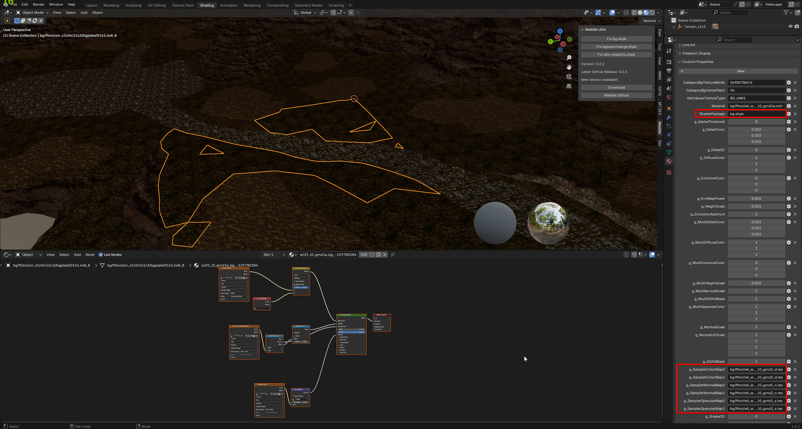
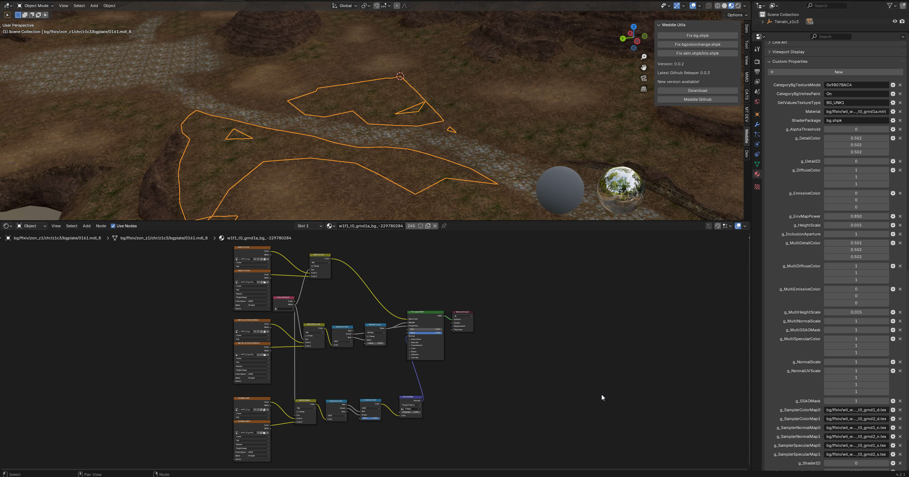

# Meddle Tools
This project is a Blender addon that provides various helper functions to assist working with [Meddle](https://github.com/PassiveModding/Meddle) exports.

## Installation
- Head to [Releases](https://github.com/PassiveModding/MeddleTools/releases)
- Download the latest MeddleTools.zip
- Install the zip in blender 4.2+ via `Edit > Preferences > Add-Ons > Install From Disk...`

## Attributions
### [Lizzer_Tools_Meddle](https://github.com/SkulblakaDrotningu/Lizzer_Tools_Meddle) - [GNU GPL v3.0](https://github.com/SkulblakaDrotningu/Lizzer_Tools_Meddle/blob/main/LICENSE.txt)
Initial [Character Shaders](./MeddleTools/shaders.blend) and logic for character shaders + starting point for embedded blender file, shader node setups for skin, face, hair and variants.

## Usage
Access the menu via the main viewport. Current options will apply updates to all shader nodes in your scene based on the custom properties exported via Meddle.

### Terrain Example
1. Export terrain using Meddle
2. Import as glTF into blender

3. Run `Fix bg.shpk`, selecting the `cache` directory from your Meddle export
4. Add-on looks up Meddle attached *Custom Properties* and fixes the shader nodes accordingly

