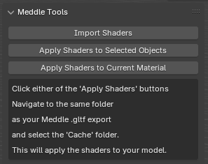
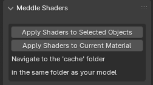
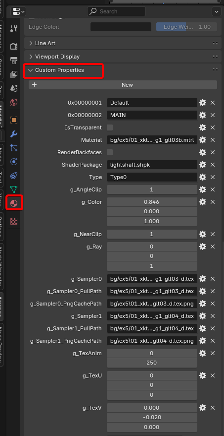

# Meddle Tools

This project is a Blender addon that provides various helper functions to assist working with [Meddle](https://github.com/PassiveModding/Meddle) exports.

## Installation
- Head to [Releases](https://github.com/PassiveModding/MeddleTools/releases)
- Download the latest MeddleTools.zip
- Install the zip in blender 4.2+ via `Edit > Preferences > Add-Ons > Install From Disk...`

## Usage

Simply click `Import .gltf/.glb` and navigate to the same folder you exported from meddle and select the `.gltf` or `.glb` file, you can select multiple files from the same folder if you need.

If you need to re-apply the shaders, you can use the shaders panel. If applying to multiple meshes, select them in the Layout view and click the 'Apply Shaders to Selected Objects' button. If you are in the shader view and have a material already open, select the 'Apply Shaders to Current Material' button to update only the active material. The import shaders and re-import shaders aren't typically needed as it is performed automatically.

> NOTE: Make sure you export with Character Texture Mode set to 'raw' from the Meddle plugin

# How does MeddleTools work?
Any models/meshes exported by the Meddle XIV plugin will have the relevant keys and values supplied by the in-game shaders attached under Custom Properties of the material once imported into Blender.

In general, Meddle will spawn textures for all cached textures by referencing the `/cache` folder in your export directory. It will then make use of the other properties and hand crafted node groups imported from [MeddleTools/shaders.blend](MeddleTools/shaders.blend) to set up each material.

# Limitations

## Array textures
Certain materials have properties (or color tables) which include indexes into array textures. Blender does not support indexed texture arrays so MeddleTools will spawn an individual texture for each referenced array index. Currently MeddleTools does not make use of these outside spawning the textures due to difficulties in testing and validating accuracy.

## Lights
A lot of properties of in-game lights do not translate well to blender, I have listed them below

### Shadows
In-game Lights have properties such as ShadowNear and ShadowFar, some lights are placed within meshes which would typically occlude them, but if the ShadowNear value exceeds the distance from the source of the light to the mesh, it would not be occluded (this is an assumption but from testing appears true). There does not appear to be a blender supported method of handling this.

These lights can affect characters and objects differently, and have toggles which indicate whether or not to cast shadows for Characters/Objects independently. This doesn't appear achievable in blender without significantly more complex setup and light linking.

### Light types
- Area: Supported in blender but does not translate to KHR_lights_punctual (glTF)
- Capsule: Generally equivalent to Area light but with an ellipse shape, does not translate to KHR_lights_punctual (glTF)
- Point: Supported
- Spotlight: Supported
- Directional: Supported

### Light intensity
Light color/intensity is represented as a HDR, i.e. values could be RGB (0.5, 1.0, 23.5), this does not translate well to Blender despite it supporting HDR under the hood. Current approximations use reinhardt tone mapping (L / (1+L)) to convert the HDR light to RGB. This works to a degree but is far from accurate to in-game.

## LODs and Mips
Lower lods are not exported by Meddle and as such filling a scene with lower poly models is not achievable.
Meddle exported PNG files are exported using the Highest Mip level for the texture, therefore dynamic mip levels are not achievable

## Animated materials
Lightshaft and bguvscroll materials can be animated in-game. This is not currently supported as it is rather difficult to animate these for rendering. It is technically feasable but would require significantly more reverse engineering of these shaders to get something accurate which can be translated to frame-based instead of time-based in blender.

## Unsupported shaders
Some shaders are not yet supported. If you wish to get support them, please attempt to recreate them yourself and make a pull request or submit an issue with your research. It is extremely time consuming to reverse engineer in-game shaders and any support is welcome.

## Attributions
### [Lizzer_Tools_Meddle](https://github.com/SkulblakaDrotningu/Lizzer_Tools_Meddle) - [GNU GPL v3.0](https://github.com/SkulblakaDrotningu/Lizzer_Tools_Meddle/blob/main/LICENSE.txt)
Initial [Character Shaders](./MeddleTools/shaders.blend) and logic for character shaders + starting point for embedded blender file, shader node setups for skin, face, hair and variants.
