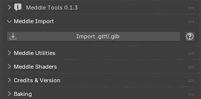

# Meddle Tools

This project is a Blender addon that provides various helper functions to assist working with [Meddle](https://github.com/PassiveModding/Meddle) exports.

## Installation
- Head to [Releases](https://github.com/PassiveModding/MeddleTools/releases)
- Download the latest MeddleTools.zip
- Install the zip in blender 4.2+ via `Edit > Preferences > Add-Ons > Install From Disk...`

## Usage

1. Import meddle .gltf into blender
2. Select the model imported, or any meshes you wish to apply shaders to
3. Select 'Apply Shaders' and open the 'Cache' folder from your Meddle export folder

> NOTE: Make sure you export with Character Texture Mode set to 'raw' from the Meddle plugin

## Attributions
### [Lizzer_Tools_Meddle](https://github.com/SkulblakaDrotningu/Lizzer_Tools_Meddle) - [GNU GPL v3.0](https://github.com/SkulblakaDrotningu/Lizzer_Tools_Meddle/blob/main/LICENSE.txt)
Initial [Character Shaders](./MeddleTools/shaders.blend) and logic for character shaders + starting point for embedded blender file, shader node setups for skin, face, hair and variants.
